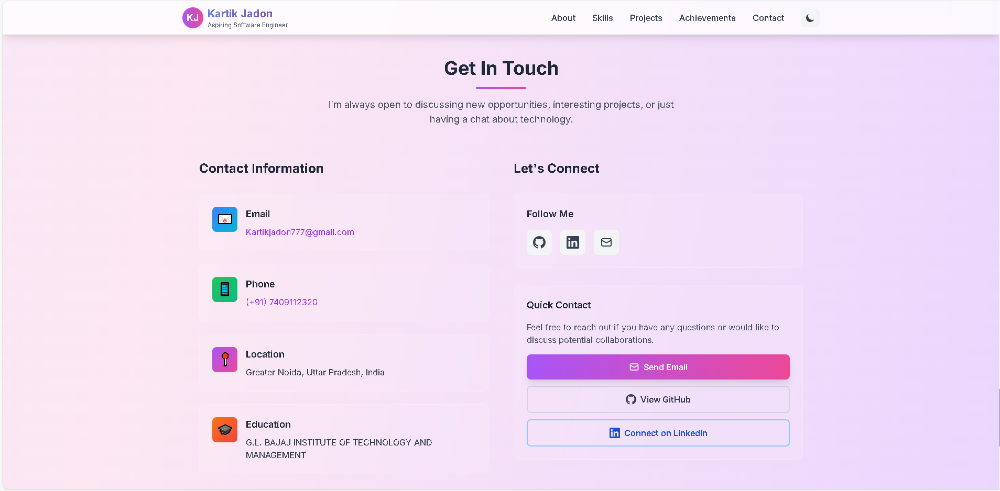
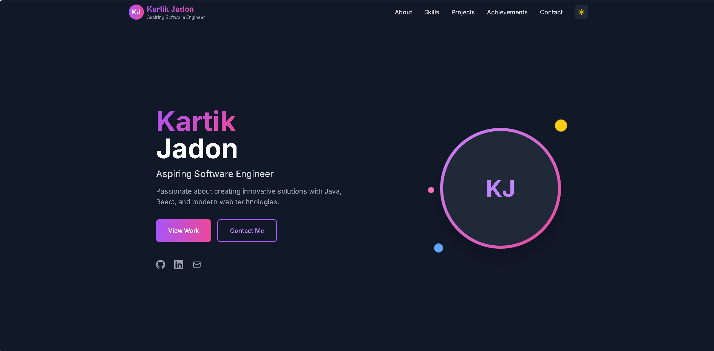
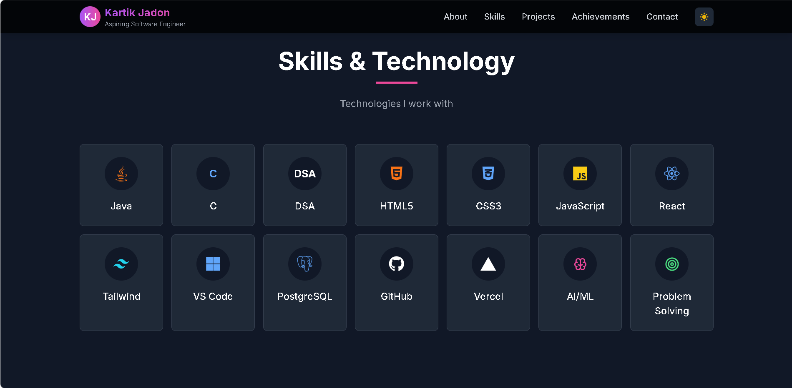
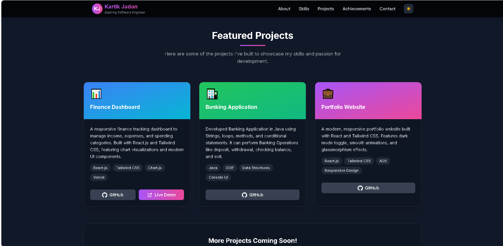

# Portfolio Website

A modern, responsive portfolio website built with React and Tailwind CSS, featuring dark/light mode, smooth animations, and a clean UI.

## 🚀 Live Demo

[View Live Demo](https://thakurkartik30.github.io/portfolio-website)

## 🖼️ Screenshots

### Light Mode


### Dark Mode



### Skills Section


### Projects Section


## 🛠️ Technologies Used

- **Frontend**: React.js, Tailwind CSS
- **Animations**: Framer Motion
- **Icons**: React Icons
- **Version Control**: Git & GitHub

## 🚀 Features

- 🌓 Dark/Light Mode Toggle
- 📱 Fully Responsive Design
- ✨ Smooth Animations
- 🎨 Modern UI with Glassmorphism Effects
- ⚡ Optimized Performance

## 📦 Getting Started

### Prerequisites
- Node.js (v14 or later)
- npm or yarn

### Installation
```bash
# Clone the repository
git clone [https://github.com/Thakurkartik30/portfolio-website.git](https://github.com/Thakurkartik30/portfolio-website.git)

# Navigate to the project directory
cd portfolio-website

# Install dependencies
npm install

# Start the development server
npm start